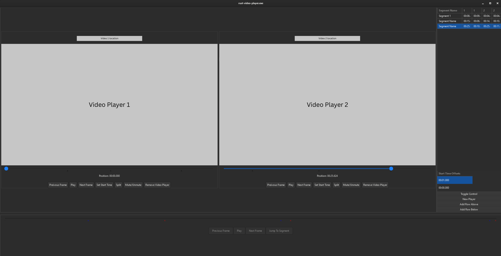

# Multi-Video Timing Analysis Tool

This timing analysis tool helps syncronize multiple point of view recordings for easier side by side comparison. 

## Features

 - Up to 6 simultaneous video players
 - User-defined segment timings
 - Individual and synchronized video playback
 - Precise frame stepping
 - Adjustable segment comparison view
 - Custom seek bars with displayed segment marks

## Installation / Setup

## Interface

### Main window
The main window is where the video player and individual controls will be viewable. The size of the video players will scale down as more video players are added.

### Video player
This is where videos can be viewed and interacted with interacted with individually. Controls include: seek bar to move to any part of the video, play/pause, frame stepping, mute audio, start time set button to move where segment timing should begin, split button to record a specific point in the video to the split panel.

### Split panel 
The panel on the right is the split panel where all the segment time information is stored. The top table includes a column for each video player currently in the main window, and a row for each segment added. The bottom table includes the user-defined starting time for each video. The times on the split table may be updated manually by editting the time in the table or by highlighting the segment you want to edit and going to any point in the video and clicking the split button in the video controls. Additionally, this panel includes buttons to add new video players, add and remove timing segments, and toggle to synchronized video playback.

### Bottom seek bar / sync view
After toggling to the sync view all the videos will be set to the beginning (user-defined start time) and their clocks become synced. The shared seek bar at the bottom now includes marks for each split segment where each color represents a different video. The user controls here are now shared amoung all the videos and keep the videos at the same relative times. Finally, this seek bar includes a jump to segment button which will changing the relative starting time to the start of the highlighted segment in the split panel when pressed. This feature may be used if you wish to compare different segments rather than the whole video without having to reset the project and redefine the segment and start times.

## Usage
Once opened and running you can begin adding video players to the main window by clicking the "New Player" button in the right panel. This will prompt the user to select a video from the local machine file browser. Selecting a valid file type will create a new player in the main window with the loaded video and its controls. You may add new segments by clicking the button again in the right panel. Highlight the newly added segment and then use the scrubber in the video player panel to seek to a desired location in the video. Once you have moved to a position in the video you can click the split button in the video player controls and the time will appear in the table next to the segment you highlighted. There are two times that appear in the split table. The first time shows the relative time since the start of the clip. The second time is the duration of segment itself. Because the first time is relative to the start of the clip the user may edit the time in table at the bottom in the same way as the segment time to set the start time offset of an individual video. This will allow the user to adjust where the timing starts from and all the times in the table will be updated to match the new starting position. You may repeat this for each additional video you wish to include.

After the video players are added and all the segment information is setup the user may click the "Toggle Control" button in the right panel to synchronize the videos together. This enables the shared controls in the bottom panel. With the seek bar scrubbing, play/pause, and frame stepping controls the user may accurately analyze the differences in videos in real time. If the user chooses, they may highlight a segment in the right panel then click the jump to segment button in the bottom panel. This feature will temporarily move the start time offset value to the start of the highlighted segment to perform additional analysis.

